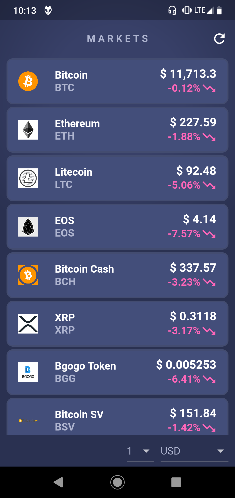

# crypto_coin_market
Crypto currency mobile app explorer build with flutter.
The data is from [CryptoCompare](https://www.cryptocompare.com/) API.

<p align="center">
  
  
  
</p>

## Getting started

#### 1. [Setup Flutter](https://flutter.io/setup/)

#### 2. Clone the repo

```sh
$ git clone https://github.com/hirohito-protagonist/crypto_coin_market.git
$ cd crypto_coin_market/
```

## What is Flutter?

Flutter is a new project to help developers build high-performance,
high-fidelity, mobile apps for iOS and Android from a single codebase.
To learn more about Flutter, visit [flutter.io](https://flutter.io/).

# License
[MIT](/LICENSE)